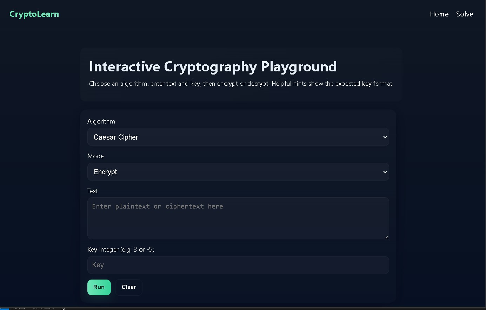
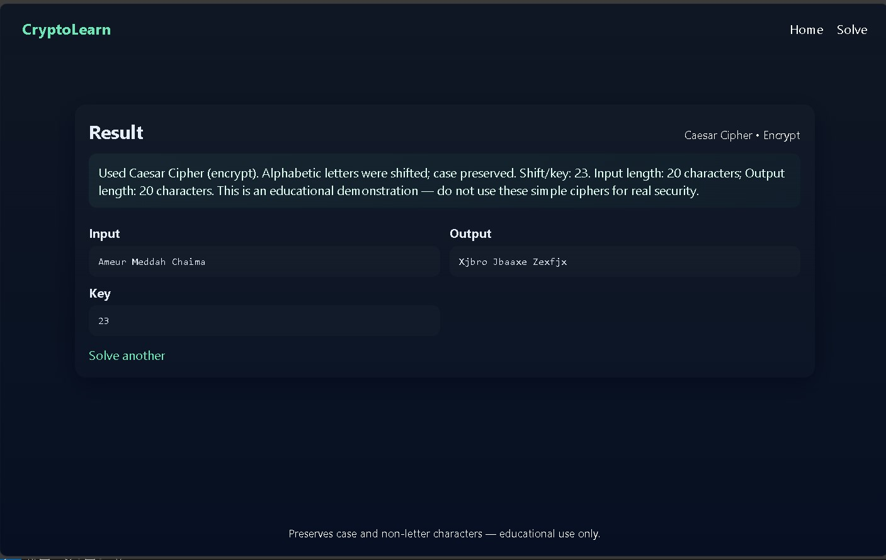

# CryptoLearn — Interactive Cryptography Playground

An educational web app to learn classic ciphers by doing. Clean UI, interactive playground, and clear explanations so students can experiment with algorithms (Caesar, Vigenère, Substitution, Atbash, ROT13, XOR) and see results instantly.

This repo contains a small Flask app (`app.py`) plus modern static assets in `static/` and templates in `templates/`.

Why this project
- Focused on learning: preserves case and non-letter characters so results are easy to read.
- Play & teach: encrypt/decrypt modes, algorithm hints, and clean result display.
- Portable: can run locally, in Docker, on Heroku, or be converted to a static client-side app for Vercel.

Quick demo (local)
1. Create virtual env and activate (PowerShell):

```powershell
python -m venv .venv
.\.venv\Scripts\Activate.ps1
python -m pip install --upgrade pip
pip install -r .\requirements.txt
```

2. Run the app:

```powershell
python .\app.py
# open http://127.0.0.1:5000
```

If you prefer Flask CLI:

```powershell
$env:FLASK_APP = 'app.py'
$env:FLASK_ENV = 'development'
flask run --host=0.0.0.0 --port=5000
```

Common issue: Werkzeug / Flask import error
- If you see an ImportError about `url_quote` when running `flask` or `python app.py`, your environment likely has mismatched versions (Flask 2.1.x vs Werkzeug 3.x). Fix by pinning Werkzeug:

```powershell
pip install Werkzeug==2.2.3
```

Project structure
- `app.py` — Flask application and cipher implementations.
- `templates/` — Jinja templates: `index.html`, `solve.html`, `solution.html`.
- `static/` — CSS and JS: `styles.css`, `app.js` and images.
- `requirements.txt` — pinned Python packages.
- `Procfile` — for Heroku (`web: gunicorn app:app`).

Features
- Caesar (encrypt/decrypt)
- Substitution (26-letter key)
- Vigenère (keyword, encrypt/decrypt)
- Atbash (symmetric)
- ROT13
- XOR (hex output / decrypt from hex)
- Responsive modern UI, algorithm hints, and clear output/summary

API and automation
- The app uses form POSTs for the web UI. If you want to automate usage, add a minimal route or implement an API endpoint (can be done as serverless function under `api/` for Vercel).

Deployment options (short)
- Heroku: uses existing `Procfile`. Push to Heroku git and set env vars.
- Docker: build a small image and run with Gunicorn. (I can add a `Dockerfile` on request.)
- Vercel (recommended static path): convert templates to static HTML and port cipher logic to client-side JavaScript; then deploy the `public/` folder.

Vercel conversion notes (fastest route)
1. Move `static/` to `public/` (or copy `styles.css`/`app.js` there).
2. Convert `templates/solve.html` and `solution.html` to plain HTML and use `app.js` to run cipher functions client-side (I can port Python functions to JS for you).
3. Run `vercel` CLI to deploy.

Security & production tips
- NEVER run the Flask dev server in production; use Gunicorn + reverse proxy (nginx) or platform-managed runtime.
- Use environment variables for secrets (e.g. `SECRET_KEY`).
- Pin package versions in `requirements.txt` and test in a virtualenv.

Roadmap & contributions
- Add step-by-step visualizers for Caesar and Vigenère.
- Add unit tests for each cipher (pytest).
- Add presets and interactive tutorials.

If you'd like, I can:
- Convert the app to a fully static client-side site (ready for Vercel)
- Add a `Dockerfile` and a `vercel.json` or a `runtime.txt` for Heroku
- Add unit tests and CI workflow (GitHub Actions)

Contact
- Open an issue or push a branch — I can implement any of the next steps for you.

License
- Add your preferred license or tell me and I can add an `MIT` or similar boilerplate.

# Cryptography Algorithm Solver

This Flask application provides a simple web interface to solve various cryptography algorithms including Caesar, Substitution, and Vigenère ciphers. Users can input their plaintext along with the selected algorithm and key, and the application will return the corresponding ciphertext.

## Interface Screenshots

### Home Page



### Solution Page




## Getting Started

To get started with this application, follow these steps:

1. **Clone the Repository**: Clone this repository to your local machine using `git clone`.

2. **Install Dependencies**: Navigate to the project directory and install the required dependencies using `pip install -r requirements.txt`.

3. **Run the Application**: Execute `flask run ` to start the Flask application.

4. **Access the Web Interface**: Open your web browser and go to `http://localhost:5000/solve` to access the application.

## Usage

Once the application is running, you can use the following steps to encrypt your plaintext:

1. Navigate to the homepage.

2. Enter your plaintext, select the desired algorithm (Caesar, Substitution, or Vigenère), and provide the encryption key.

3. Click on the "Solve" button to encrypt the plaintext.

4. The application will display the ciphertext along with the provided algorithm, plaintext, and key.

## Supported Algorithms

This application supports the following cryptography algorithms:

- **Caesar Cipher**: Shifts each letter in the plaintext by a certain number of places determined by the key.
  
- **Substitution Cipher**: Replaces each letter in the plaintext with a corresponding letter from the provided key.

- **Vigenère Cipher**: Uses a keyword to shift each letter in the plaintext by different amounts, creating a repeating key pattern.

## Contributing

Contributions are welcome! If you find any issues or have suggestions for improvements, feel free to open an issue or create a pull request.

